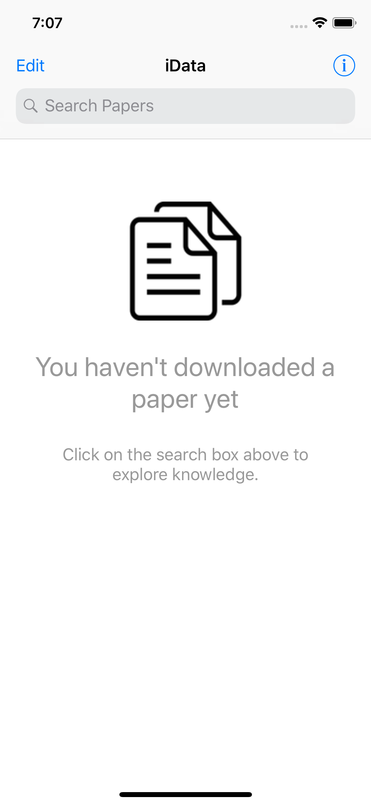
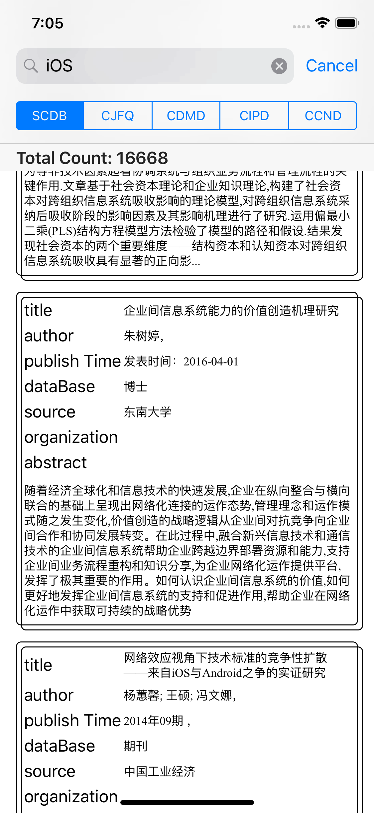
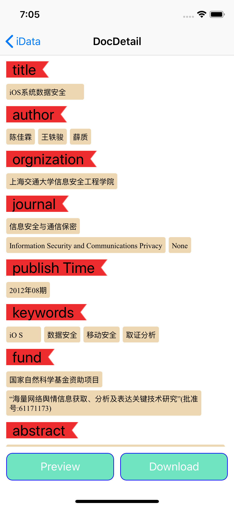
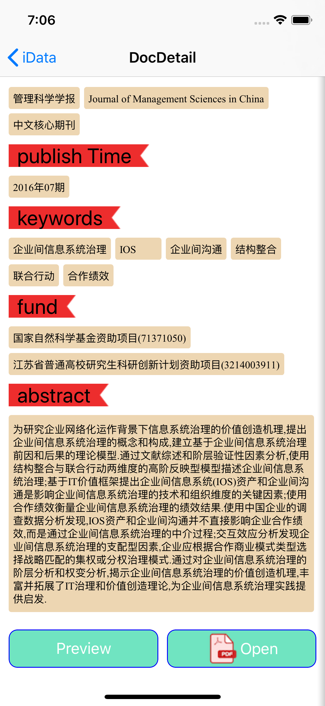
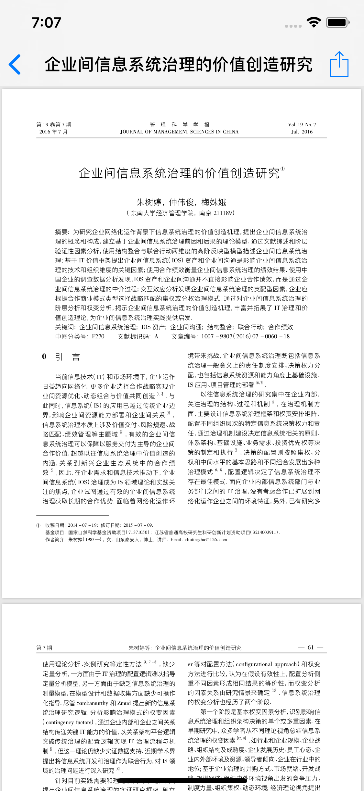
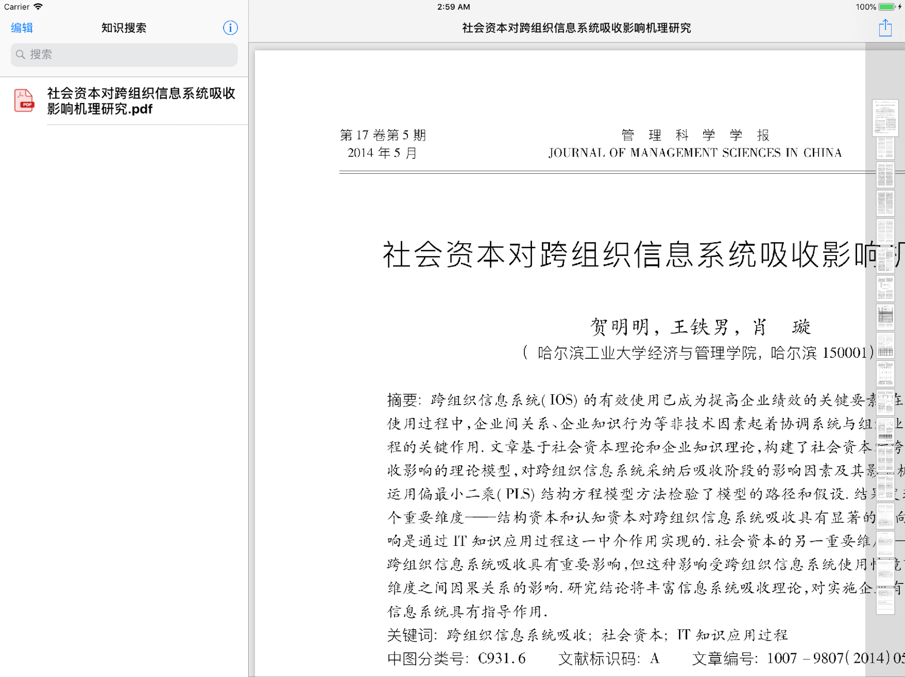
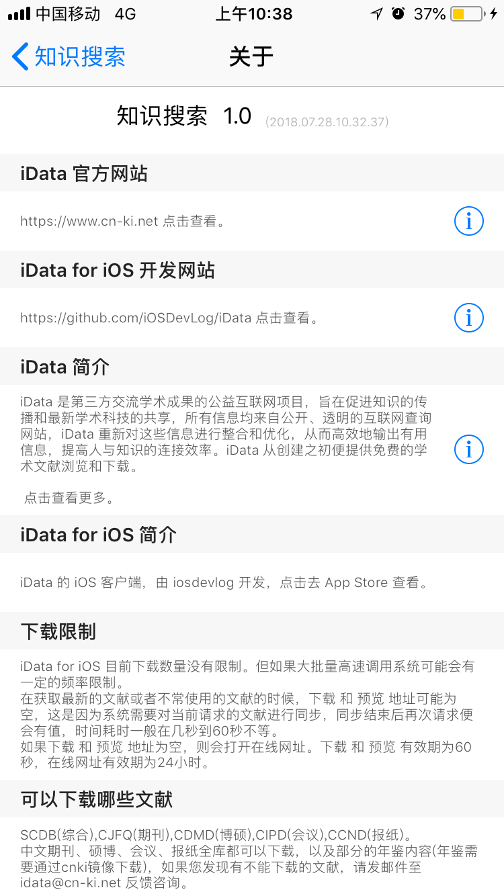

# iData for iOS
---

iData: <https://www.cn-ki.net>
iData for iOS: <https://github.com/iOSDevLog/iData>

# Screenshots
---

# Licence
---

`iData` is released under the MIT license. See [LICENSE](LICENSE) for details.
